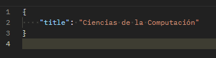
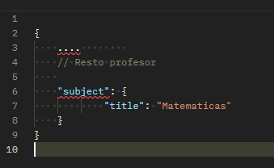

- BackEnd despliega en el puerto 8080  
 
- **Rutas TEACHERS** 
  - Obtener todos los profesores:   
  localhost:8080/api/admin/teachers
  - Obtener 10 profesores al azar:  
  localhost:8080/api/public/index
  - Buscar por id:  
  localhost:8080/api/public/{id}
  - Guardar nuevo profesor:  
  localhost:8080/api/admin/teachers
  - Eliminar profesor:  
  localhost:8080/api/admin/teachers/{id}
  - Buscar profesores por categoría(s) (ej. Matemáticas, Historia):    
    localhost:8080/api/public/teachers/category?subjects=Matematicas,Historia  
    
- **Rutas USERS**  
 
  - Obtener todos los usuarios registrados:  
  localhost:8080/api/user/users  

- **OTRAS**
  - Agregar un nuevo subject (categorias) , solo ADMIN:  
   
    localhost:8080/api/admin/subjects/add
  
   
  - Editar el subject (categorias) de un profesor, solo ADMIN:  
  
    localhost:8080/api/admin/teachers/{id}  

    
  
**IMPORTANTE:**  
Para acceder a las rutas user y admin se requiere tener el usuario disponga del rol respectivo en firebase.  
para ello se debe enviar el token de autenticación en el header de la petición.  
El token se obtiene al loguearse en la aplicación front-end.  

Los roles estan definidos en letras MAYUSCULAS  

Hay dos usuarios creados para propósito de Testing:
- email:rofaba@gmail.com
- password:qwerty
- rol: ADMIN  
  

- email:testuser@gmail.com
- password:qwerty
- rol: USER  

**Formato para teacher**  

- Base de datos temporal es H2 en MEM, se crea al levantar el back.
  url=jdbc:h2:mem:tutorlink  
  consola: localhost:8080/H2-console  
      user: sa  
      password: sa